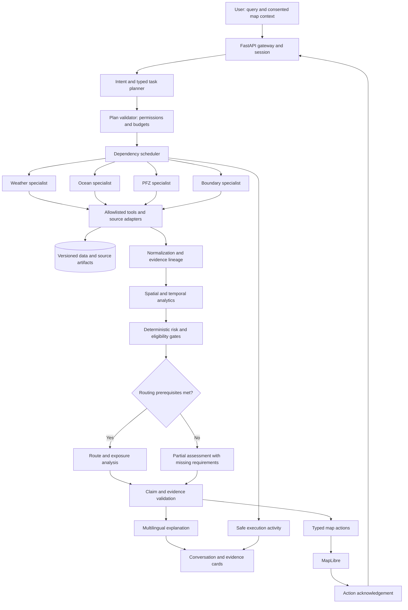

# SafeLink: agentic marine intelligence technical design

Status: proposed architecture, not a statement of deployed functionality. Prepared 5 September 2026 against the existing SafeLink repository.

## 1. Executive overview

Evolve SafeLink into an evidence-driven marine decision-support system. A bounded planner dispatches specialized workers; deterministic geospatial and policy services calculate results; an explanation model translates verified results into conversation and map actions. The model chooses operations but does not invent measurements, authorize navigation, or determine legal boundaries.

Keep the existing React/MapLibre map, FastAPI data service, Copernicus ingestion, INCOIS PFZ service, and Groq adapter. Add typed planning, evidence provenance, weather/advisory adapters, and reproducible assessments before adding routing or continuous vessel monitoring.

The production objective is defensible recommendations with explicit limits, not agreement with another visualization or a claim of 100% accuracy.

## 2. Functional requirements

| Priority | Requirement | Acceptance criterion |
|---|---|---|
| P0 | Nearest official PFZ | Search every valid MultiLineString component; identify advisory version and nearest point |
| P0 | Ocean conditions | Return actual native-grid location/time, units, missingness, and source |
| P0 | Map-assisted conversation | Validated commands, action acknowledgements, cancellable movement |
| P0 | Location consent | No device lookup until a user gesture; manual point alternative |
| P0 | Evidence | Every numerical recommendation resolves to immutable evidence |
| P1 | Time-window assessment | Evaluate outbound, fishing and return periods, not departure alone |
| P1 | Weather and notices | Coverage and freshness checks; empty results distinguish unavailable feeds |
| P1 | Multilingual text | Preserve numbers, place identity, warnings and uncertainty in translation |
| P2 | Candidate ranking | Hard exclusions precede any productivity or distance score |
| P2 | Routes/geofencing | Vessel profile, suitable licensed data and validated algorithms required |
| P3 | Voice, reports, research | Explicit retention and export choices; reproducible analysis |

For public users, browsing remains anonymous. Saved vessels, alerts and trip histories require accounts. Government operators and researchers receive role-specific views without altering evidence.

## 3. System architecture

Separate four planes: interaction, execution, data and governance. The API accepts a query plus consented map context. The planner creates a typed dependency graph. A scheduler executes approved tools under deadlines and budgets. Normalization produces evidence objects, analytics derives results, policy gates decide what can be recommended, and a constrained synthesizer produces text and map commands.

Raw raster data never enters LLM prompts. Models receive compact observations and evidence IDs. Heavy computations execute in workers. A single query uses a consistent dataset snapshot so refreshed products cannot silently change its result halfway through.

## 4. Multi-agent architecture

An agent is a bounded responsibility with typed inputs/outputs, permitted tools and a budget. It need not be a separate LLM process. Start with one planning model, deterministic specialist workers, and one synthesis call. Add specialist LLMs only where evaluation shows a benefit, such as document interpretation or ambiguous dataset discovery.

This produces actual delegation and aggregation while avoiding twelve model calls for a simple question. A direct layer-switch request takes the short path; a trip assessment creates a parallel graph.

## 5. Agent responsibilities

| Agent | Responsibility | Output and authority |
|---|---|---|
| Planner | Intent, missing inputs, dependency graph | TaskPlan; cannot override policy gates |
| Discovery | Search approved product registry | DatasetSelection; cannot activate arbitrary endpoints |
| Weather | Forecast/advisory acquisition | WeatherObservation and Hazard |
| Ocean | Surface fields, time series, anomaly computation | OceanObservation and AnalysisResult |
| PFZ | Official advisory parsing and candidate enumeration | PFZCandidate; derived habitat is separately named |
| Geospatial | Distance, intersections, buffers, spatial matching | SpatialResult from deterministic code |
| Route | Time-dependent candidate paths | RouteCandidate with feasibility and exposure |
| Risk | Apply approved vessel/context policies | RiskAssessment, missing requirements and rule IDs |
| Boundary | Jurisdiction, temporal restrictions, proximity | RestrictionCheck or GeofenceEvent |
| Visualization | Prepare typed layer/feature actions | MapActionBatch referencing server-owned features |
| Explanation | Convert assessments to cited language | Recommendation; cannot change risk status |
| Conversation | Language, references, clarification, consent | IntentContext and confirmed user inputs |

Every specialist returns partial results and failure details in the same envelope. Agents cannot send arbitrary instructions to one another or recursively spawn unlimited work.

## 6. Agent communication flow

Use immutable messages containing query_id, task_id, parent_ids, schema_version, input_refs, output_refs, deadline, trace_id and status. Workers communicate through the scheduler and evidence store. No unrestricted agent chat bus.

The orchestrator joins by candidate_id, geometry version, variable, valid interval, depth and model run. It preserves conflicting sources as separate records. Derived results list all parent evidence IDs and the algorithm version. An assessment is ready only when its required dependencies succeeded or were explicitly marked missing.

## 7. End-to-end query lifecycle

1. Validate request, session, consent and rate limits; assign query ID.
2. Resolve intent, language, selected feature, requested time and vessel context.
3. Ask only for blocking inputs: starting point, departure window or vessel limits when needed.
4. Validate the model's TaskPlan against tool permissions, cost and dependency limits.
5. Pin source versions; dispatch weather, ocean, PFZ and restrictions concurrently.
6. Normalize units/time/geometry; reject invalid records; record missing coverage.
7. Generate PFZ candidates and spatial distances; sample relevant time windows.
8. Apply official notices and vessel-policy constraints; route only eligible candidates.
9. Validate proposed claims and map commands against evidence and completed results.
10. Stream activity, assessment, explanation and map commands; store audit references.

Cancellation propagates to tools and model streams. Completed evidence may be cached, but cancelled recommendations are never marked complete.

## 8. Tool/function architecture

All tools return the envelope in section 30. Required input names below are mandatory; optional inputs have server defaults. Bbox, result count, time range and output size have hard server limits. Tools return normalized IDs and values, not arbitrary executable content.

| Tool / permitted agent | Required inputs | Optional inputs | Output payload | Failure conditions |
|---|---|---|---|---|
| discover_datasets / Discovery | variables, bbox, interval | resolution, authority | products[], suitability[], gaps[] | no permitted product, registry unavailable |
| get_ocean_series / Ocean | point, interval, variables | depth=surface, product_ids | observations[] | outside grid/horizon, missing pixels |
| get_weather_series / Weather | point, interval, variables | model_ids | observations[] | no coverage, provider failure |
| get_tides / Ocean | station_or_point, interval | datum | predictions[], datum | no validated station/model, datum unknown |
| get_advisories / Weather | bbox, interval, categories | authority | hazards[], feed_status | stale/inaccessible feed, parse failure |
| get_official_pfz / PFZ | bbox, date | advisory_id | candidates[], advisory_status | no valid advisory, withdrawn/stale |
| nearest_pfz / Geospatial | origin, advisory_version | limit=5 | candidates[{id, point, distance_m, bearing_deg}] | invalid origin/geometry, empty advisory |
| analyze_productivity / Ocean | bbox, interval, variables | baseline, species | anomalies[], associations[], limitations[] | insufficient history/QC; no causal identification |
| check_restrictions / Boundary | geometry, interval, vessel_context | buffer_m | intersections[], coverage, rule_refs[] | missing jurisdiction/rules/version |
| spatial_operation / Geospatial | operation, geometry_refs | metric_crs, buffer_m | geometry_ref, metrics | invalid topology, unsuitable CRS |
| assess_trip / Risk | evidence_refs, vessel_profile, trip_window | policy_version | assessment | missing critical inputs yields UNKNOWN |
| plan_routes / Route | origin, target, departure, vessel_profile, snapshot | max_alternatives | routes[], infeasibility_reasons[] | unverified navigation data, no feasible path |
| evaluate_geofence / Boundary | position, timestamp, accuracy_m, zone_version | course, speed | events[], distance_m, crossing_interval | stale position, unknown course, stale zone |
| prepare_map_actions / Visualization | result_refs, viewport | preferred_layer | actions[] | missing feature/version, unsupported action |
| request_location / Conversation | purpose | suggested_region | consent_request_id, pending | denied/unavailable handled by UI |
| make_report / Explanation | assessment_id, language | detail, format | report_ref, evidence_refs | insufficient evidence, unauthorized export |

Existing tools get_nearest_pfz, get_marine_conditions, get_pfz_details, resolve_location, get_data_availability and update_map remain compatibility wrappers. New capabilities must not silently change old meanings.

## 9. Structured schemas

Common fields: schema_version, id, source_id, product_id, model_run, retrieved_at, observed_at or valid_interval, geometry_ref, resolution_m, units, quality_flags, evidence_refs, missing_reason. Use UTC RFC3339 times; retain the user's IANA timezone separately. GeoJSON coordinates are longitude, latitude.

| Object | Additional required fields |
|---|---|
| MarineObservation | variable, value or null, unit, kind, sample_location, requested_location, depth_m |
| WeatherObservation | MarineObservation plus elevation/reference convention where relevant |
| OceanObservation | MarineObservation plus vertical_datum when applicable |
| Hazard | authority, category, severity, valid_interval, geometry_ref, official, original_text_ref |
| PFZCandidate | advisory_id, feature_id, component_id, nearest_point, issued_at, valid_until or unknown |
| RouteCandidate | geometry_ref, departure, arrival, segment_exposures, feasibility, constraints_version |
| GeofenceEvent | zone_id, state, position_age_s, distance_interval_m, crossing_time_interval or null |
| EvidenceRecord | immutable source artifact hash, extraction path, transformation lineage |
| RiskAssessment | status, triggered_rules, missing_requirements, evidence_quality, policy_version |
| Recommendation | decision, candidate_ids, claims[], caveats[], evidence_refs |
| AgentExecutionTrace | agent, tool, state, duration, source_refs, safe status label |

Confidence is not a bare model-supplied number. Nulls carry reasons; zero remains a real measured/modelled value.

## 10. Dataset/API integration strategy

| Category | First choice | Secondary/qualification |
|---|---|---|
| Official PFZ | Existing INCOIS adapter | No synthetic official advisory fallback |
| Surface ocean fields | Existing Copernicus products | Product-specific quality documents and source-grid sampling |
| Weather/wind | Open-Meteo prototype connector | Direct official/model feed where permitted; retain underlying model lineage |
| Cyclone/high-wave warnings | IMD and INCOIS official products | Adapter access and redistribution must be verified per feed |
| Lightning | Authorized observation/nowcast provider | Thunderstorm forecasts cannot substitute for lightning detections |
| Tides | Validated local predictions/gauges | Sea-level anomaly is not a tide prediction |
| Bathymetry | GEBCO for broad research context | Operational routing needs suitable hydrographic/chart data and datum |
| Boundaries/restrictions | Competent authority notices and maintained datasets | Marine Regions for research overlays only |
| Protected areas | Relevant government designation/rules | Geometry alone does not establish all permitted activities |
| Land/harbours | Existing map assets, permitted OSM sources | Map features are not navigational charts |
| Research history | Copernicus, NASA/ISRO/NOAA relevant products | Registry onboarding verifies access, licence, QA and coverage |

INCOIS describes its PFZ service as satellite-informed advisories and notes seasonal/adverse-condition interruptions. An absent advisory cannot be treated as a forecast of no fish. [INCOIS PFZ](https://incois.gov.in/MarineFisheries/PfzAdvisory)

Open-Meteo supplies marine forecast variables, but horizon and coverage must be read from actual products. Its free hosted service is for evaluation/prototyping; commercial service has separate terms even though data carry attribution licensing. [Marine API](https://open-meteo.com/en/docs/marine-weather-api), [pricing](https://open-meteo.com/en/pricing), [data licence](https://open-meteo.com/en/license)

Marine Regions explicitly excludes navigational and legal use. It cannot establish operational permission to cross a boundary. [Terms](https://www.marineregions.org/disclaimer.php)

Each registry entry records authentication, licence/redistribution, coverage, latency, update schedule, uncertainty, upstream model family and outage policy. Two APIs distributing the same model are not independent cross-validation.

## 11. GIS architecture

Store authoritative vectors in PostGIS EPSG:4326 with GiST indexes. Use geography/geodesic calculations for distances; use an appropriate local metric projection for buffers and area. Never buffer longitude/latitude by a value intended as metres. Preserve holes, islands, estuaries and MultiLineString component identity.

Use pyproj plus Shapely/GEOS for bounded worker geometry operations and xarray for gridded fields. Retain native grids for science; generate Web Mercator display tiles separately. Antimeridian crossing, polar limits, no-data coast cells and invalid geometry need explicit tests. Repair topology only through a recorded ingestion step; do not silently move official boundaries.

## 12. Spatial-temporal reasoning

Resolve 'tomorrow morning' to a local interval and show the interpretation. Store forecast issue time, valid time, retrieval time and observation time separately. The newest downloaded file may contain an old observation.

Sample spatially using product-approved methods and return native-cell distance/resolution. Interpolate time only within supported brackets; disclose interpolation. Do not extrapolate observations into a forecast. Keep cloud-masked chlorophyll missing.

Evaluate each route segment at estimated arrival time, fishing dwell and return exposure. Comparing departure scenarios requires rerunning the same pinned product set at different times. Do not assume today's PFZ advisory remains valid tomorrow.

## 13. PFZ analysis workflow

Retrieve the official advisory and validate its date/status. Enumerate all line components, compute nearest geodesic points, and preserve feature/component IDs. Report 'PFZ features', not an inferred count of independent zones.

For top candidates, sample ocean/weather windows, evaluate restrictions, and check availability of required safety inputs. Rank only candidates passing hard constraints: operational eligibility first, then exposure, feasible travel distance, and advisory relevance. SST/chlorophyll associations may support research context but never become generic catch guarantees or universal productive thresholds.

Keep experimental habitat suitability in a separate layer with model/version, species/season scope and independent validation. Never relabel it as INCOIS PFZ.

## 14. Marine safety assessment workflow

Inputs include vessel class, draft where relevant, operator-approved operating limits, trip duration, origin, target, forecast window and official notices. Thresholds must come from qualified review and applicable guidance; this design deliberately does not invent universal wave/wind cutoffs.

Policy order: applicable official prohibition or hard operational restriction; vessel-limit exceedance; deterioration/uncertainty; lower-risk findings. Return one of DO_NOT_VENTURE, HIGH_RISK, CAUTION, LOWER_RISK or UNKNOWN. Use 'lower risk under the checked conditions' instead of unconditional 'Safe'. Missing critical feeds forces UNKNOWN, even if available waves look small. A positive critical hazard remains HIGH_RISK/DO_NOT_VENTURE despite missing other feeds; report evidence completeness independently.

Each triggered rule records observed value, threshold source, applicable interval, geometry and evidence. User-facing outputs distinguish official warnings from SafeLink's derived assessment.

## 15. Route optimization workflow

Routing is a gated advanced capability. Require suitable navigable-water data, draft/clearance constraints, applicable restrictions, vessel speed model, environmental forecasts and a validated policy. GEBCO or a coastline mask alone is insufficient to claim a navigable route.

Build a water graph or navigation mesh with valid crossings; remove land, prohibited areas and infeasible depth/clearance edges. Use time-dependent A*/multi-label search. Recompute arrival time using vessel performance and current projection; reject stalled/unsafe edges. Evaluate whole edges, not just their endpoints, against hazard polygons and time intervals.

Apply hard constraints before optimizing a Pareto set over exposure, travel time and fuel proxy. Fuel estimates require a calibrated vessel model; otherwise return relative effort only. Include outbound and return legs. If no validated feasible route exists, return 'route unavailable'; never substitute a straight line labelled safe.

## 16. Geofencing system

Store versioned zones with jurisdiction, effective time, expiry, source authority, applicable vessel/activity and rule text. Evaluate on location updates and zone changes. States: outside, approaching, uncertain, inside, stale-position.

Use position accuracy and zone uncertainty in distance intervals. Trigger conservatively when the possible position region overlaps a warning buffer. Apply hysteresis and deduplication to avoid alert flapping. Predict crossing time only with recent course/speed and an explicit constant-motion assumption; otherwise return null.

Browser geolocation is a foreground MVP feature. Reliable background vessel alerts require an appropriate mobile/native or onboard integration, explicit tracking consent and delivery monitoring; do not promise them from a sleeping browser tab.

## 17. Multilingual architecture

Use a language-independent IntentContext and typed quantities. Detect language with model output plus user override. Support English/Tamil first, then Hindi, Malayalam, Telugu, Kannada, Bengali and Marathi after native-speaker testing. Preserve official place IDs; show local names and optional transliteration.

Generate explanations from verified claims, then validate numerical values, units, direction, dates and warning negation against the structured response. Use a reviewed glossary for marine terminology. Voice is a later ASR/TTS adapter with transcript confirmation for coordinates and departure times. Do not let translated free text redefine operational policy.

## 18. Conversational memory design

Separate ephemeral dialogue from confirmed task state: location source/consent, vessel profile, target feature, selected candidate, departure interval, dataset snapshot and last assessment ID. Store explicit references for 'this one' and 'the safer one'. Ask when multiple candidates are plausible.

Existing Groq history retains three completed exchanges; replace this with compact typed state plus bounded dialogue, not an indefinitely growing prompt. Redis holds active state with expiry; Postgres stores opted-in history and audit records. Revalidate stale evidence on follow-ups. Location changes invalidate distance/route/risk results. Consent withdrawal removes retained location according to the published policy.

## 19. Map interaction architecture

Keep commands allowlisted and typed. Existing controls cover fly_to, place_marker, zoom_in/out, select_layer, set_time, highlight_pfz, clear_map_highlights and request_location. Add fit_bounds, show_route, show_hazard, compare_candidates and show_timeseries using server-owned feature IDs, never arbitrary HTML or executable URLs.

Each command includes command_id, query_id, dataset_version and expiry. Browser checks schema, coverage and feature existence, then returns applied/rejected/cancelled with resulting viewport. The assistant may say 'shown' only after acknowledgement. Map panning updates context but never becomes the user's actual position. Respect user movement, reduced-motion settings and cancellation; coalesce redundant camera commands.

## 20. Explainability framework

Represent each important claim as text_template, typed values, evidence_refs and derivation_ref. Clicking a claim highlights its location and opens a compact evidence card showing source, valid time, resolution, method and limitations. Provide concise and expanded explanation modes.

The activity trace shows tool names, sources and completion/failure. It never exposes private chain-of-thought. 'Why this candidate?' compares explicit rule outcomes and metrics with another candidate under the same snapshot, rather than generating a retrospective story.

## 21. Confidence-scoring system

Separate evidence completeness, freshness, spatial suitability, cross-source agreement and validation maturity. Proposed display rubric: High only if every critical input is present/in-date, spatially suitable, no unresolved material conflict exists, and the applicable algorithm/policy is validated; Moderate for acceptable noncritical gaps; Low otherwise. Unknown safety status cannot become high-confidence safety through averaging.

Store the component vector and reasons. Initially this is an evidence-quality rubric, not a probability that a voyage is safe. Calibrate any future probabilistic outputs against held-out observations/outcomes by region, vessel and lead time; report reliability curves, sample counts and drift. Do not use the LLM's self-reported confidence.

## 22. Safety and reliability rules

No fabricated observations; no stale-as-live presentation; no false zeros; no unsupported legal or navigation permission. Keep observational, forecast, advisory and research layers distinct. Official prohibitions cannot be outweighed by fishing suitability. Unknown data never implies absence of hazards. The platform cannot certify a trip safe.

Critical recommendations must pass server policy checks and claim validation. Invalidate cached assessments when their notices, restrictions, location, vessel context or source versions change. Require expert review before enabling an operational risk policy, multilingual warning template or route engine for a new region.

## 23. Error and fallback strategy

Standard codes: OUTSIDE_COVERAGE, STALE_SOURCE, MISSING_DATA, RATE_LIMITED, PROVIDER_UNAVAILABLE, INVALID_GEOMETRY, PERMISSION_DENIED, POLICY_UNAVAILABLE, CANCELLED and NO_FEASIBLE_ROUTE.

Use per-provider concurrency limits, circuit breakers and at most two transient retries with jitter and Retry-After. Never retry invalid credentials or exhausted billing indefinitely. A fallback product retains its own resolution/run and a visible source-change flag. Cached stale observations may be shown as context but cannot satisfy current critical safety requirements.

Return partial results within deadline with missing dependencies. Never automatically fail over to a paid model. If the LLM is unavailable, deterministic PFZ lookup and layer inspection continue.

## 24. Database architecture

Postgres/PostGIS tables: datasets, dataset_versions, source_artifacts, observations_index, advisories, pfz_features, restriction_versions, vessel_profiles, trips, assessments, evidence_records, recommendations, query_runs, task_runs, consent_records and alert_events.

Use foreign keys for evidence lineage and snapshot membership, unique provider/version/hash identifiers for idempotent ingestion, GiST on geometries and B-tree indexes on valid/issue times. Partition high-volume telemetry by time and tenant. Keep large arrays in object storage rather than JSON database rows.

Vector search is optional for approved documentary material only. If needed, add pgvector with document version, source authority and validity filters. Embedding similarity does not establish an active warning or legal rule.

## 25. Caching strategy

Cache source artifacts by immutable content hash; normalized products by dataset version; tiles by layer/run/frame/z/x/y/style version; queries by geometry, variables, time interval and snapshot. Cache assessments additionally by vessel and policy versions.

Set TTL from source update cadence and advisory validity, not one global age. Use single-flight refresh and atomic manifest publication so users never see half-published five-layer sets. Keep the current seven-day active data window, while retaining small audit metadata and permitted source hashes longer under an explicit policy. A referenced artifact needed for an active assessment must not be deleted mid-query.

## 26. Backend architecture

Retain FastAPI/Pydantic. Introduce domain services behind current endpoints: registry, ingestion, normalization, GIS, PFZ, weather, restrictions, risk, routes and evidence. Keep provider adapters isolated from policy and UI.

Use a typed Python DAG scheduler with asyncio TaskGroup for network tasks and worker processes for CPU-heavy geospatial/raster work. Add a Redis-backed job queue for durable ingestion and assessments. Consider Temporal only when durable multi-hour workflows and operational scale justify its complexity; a graph framework is optional, not the source of reliability.

## 27. Frontend architecture

Retain React, TypeScript and MapLibre. Split map rendering, query state, evidence cards, activity trace and consent UI. Raster animation stays in existing workers/WebGL; avoid React re-renders per particle. Debounce viewport events and stream text in short batches.

Fetch viewport-sized vector/raster tiles with cancellation, simplify display geometry by zoom while retaining analytical originals, and show legends tied to the selected frame. Provide keyboard access, high-contrast warnings, touch targets and a reduced-motion mode. Hide unsupported layers rather than populating them with invented data.

## 28. Recommended technology stack

| Layer | Recommendation | Alternative/tradeoff |
|---|---|---|
| UI/map | Existing React + MapLibre | Rewriting framework brings little current value |
| API/contracts | FastAPI + Pydantic/OpenAPI | Keeps current Python geospatial integration |
| Model | Groq adapter for prototype | Paid provider only by explicit configuration; benchmark tool reliability |
| Orchestration | Typed Python DAG + bounded tools | Framework graph engine later if checkpointing warrants it |
| Spatial | PostGIS + Shapely + pyproj | Browser GIS for display only |
| Arrays | xarray + chunked Zarr/NetCDF | COG for suitable 2D display products |
| State/jobs | Redis + durable worker queue | In-memory acceptable only for single-instance demo |
| Storage | Current HF publication for demo; S3-compatible production storage | Versioning, access control and lifecycle policies needed |
| Observability | OpenTelemetry-compatible traces + metrics | Structured logs alone initially |

These are recommended roles, not a requirement to upgrade the repository's pinned dependencies immediately.

## 29. API endpoint design

Preserve /api/catalog, /api/field, /api/pfz and /api/chat. Introduce versioned /api/v1 endpoints:

| Endpoint | Contract |
|---|---|
| POST /queries | message + IntentContext; returns query_id and event URL |
| GET /queries/{id}/events | SSE, event IDs and reconnect support |
| DELETE /queries/{id} | cancel owned work |
| POST /map-actions/{id}/ack | applied/rejected/cancelled + actual viewport |
| GET /evidence/{id} | authorized provenance and normalized values |
| POST /assessments | trip + vessel + snapshot; 202 for queued work |
| GET /assessments/{id} | status, result, gaps and evidence |
| POST /routes | gated route request; 422 if prerequisites unavailable |
| GET /tiles/{version}/{z}/{x}/{y} | immutable display tiles |
| POST /location-consents | purpose/expiry; no automatic device access |
| POST /subscriptions | authenticated opt-in monitoring scope |
| DELETE /subscriptions/{id} | stop future monitoring |

Use 401/403 for access, 409 for incompatible state, 422 for invalid inputs, 429 plus Retry-After for limits, 503 for unavailable service. Distinguish accepted HTTP/SSE streams from successful completed AI work.

## 30. Example JSON schemas

Implement concrete Pydantic discriminated unions with extra='forbid', finite coordinate ranges and bounded arrays/strings. The following core schema anchors all tool outputs; generate endpoint-specific schemas from the object fields in section 9 and enforce operation-specific payload models rather than accepting arbitrary payloads.

```json
{
  "$schema": "https://json-schema.org/draft/2020-12/schema",
  "title": "ToolResultEnvelope",
  "type": "object",
  "additionalProperties": false,
  "required": ["schema_version", "status", "evidence_refs", "missing", "payload"],
  "properties": {
    "schema_version": {"const": "1.0"},
    "status": {"enum": ["ok", "partial", "unavailable"]},
    "evidence_refs": {"type": "array", "maxItems": 100, "items": {"type": "string", "maxLength": 80}},
    "missing": {"type": "array", "maxItems": 30, "items": {"type": "string", "maxLength": 200}},
    "payload": {"type": ["object", "null"]}
  }
}
```

Example normalized observation (illustrative values, not a live observation):

```json
{
  "id": "obs-demo-1",
  "variable": "significant_wave_height",
  "value": 1.2,
  "unit": "m",
  "kind": "forecast",
  "requested_location": {"longitude": 80.4, "latitude": 12.6},
  "sample_location": {"longitude": 80.4167, "latitude": 12.5833},
  "valid_interval": {"start": "2026-09-06T00:00:00Z", "end": "2026-09-06T01:00:00Z"},
  "model_run": "2026-09-05T00:00:00Z",
  "source_id": "configured-copernicus-product",
  "depth_m": 0,
  "resolution_m": null,
  "quality_flags": ["resolution_not_loaded"],
  "evidence_refs": ["ev-demo-1"]
}
```

Example assessment:

```json
{
  "id": "assessment-demo",
  "status": "UNKNOWN",
  "policy_version": "pilot-review-required",
  "triggered_rules": [],
  "missing_requirements": ["vessel_operating_limits", "current_official_warnings"],
  "evidence_quality": {"label": "low", "is_probability": false},
  "recommendation": "Conditions can be displayed; departure suitability cannot be established.",
  "evidence_refs": ["ev-demo-1"],
  "route": null
}
```

## 31. Example multi-agent execution trace

Illustrative, not a performance claim:

| Stage | Workers | Visible event |
|---|---|---|
| Resolve | Conversation + Planner | Confirming departure window and starting point |
| Parallel acquisition | Weather, Ocean, PFZ, Boundary | Checking four data sources |
| Join | Normalizer + Geospatial | Matching forecast times and ranking PFZ distances |
| Gate | Risk | Vessel limits unavailable; safety assessment incomplete |
| Conditional branch | Route skipped | Route recommendation unavailable with current inputs |
| Finish | Explanation + Visualization | Showing nearest advisory and available wave forecast |

Trace records contain durations, source versions and errors, never private model reasoning. A skipped task is distinct from a successful check.

## 32. Example conversations

**User:** Where is the nearest PFZ?

**Assistant:** Choose your starting point using device location or the map. After you confirm it, I can calculate the nearest point on the current INCOIS advisory.

**User:** Is tomorrow morning safe?

**Assistant:** Do you mean 05:00–09:00 local time, including your return? I also need your vessel's operating limits. I can show the available forecasts now, but those alone do not establish departure suitability.

**User:** Why not this one?

**Assistant:** The selected candidate overlaps a restriction in the checked dataset for your trip window. Its shorter distance does not override that restriction. Open the evidence card for the authority, effective dates and exact rule.

Tamil example for missing data: “அலை முன்னறிவிப்பு கிடைக்கிறது. ஆனால் தற்போதைய அதிகாரப்பூர்வ எச்சரிக்கைகள் கிடைக்கவில்லை; கடலுக்குச் செல்ல ஏற்றதா என்பதை உறுதிப்படுத்த முடியாது.” Validate operational wording with native speakers before release.

## 33. Deployment architecture

Demo: Railway serves FastAPI and built frontend; existing HF dataset publication supplies processed marine artifacts; Groq is called server-side. Keep credentials only in service variables. Do not put private vessel positions or conversations in public HF datasets.

Pilot: separate API and ingestion/analytics workers, managed PostGIS, Redis and object storage; static assets/tiles behind CDN. Use staging plus production, migration jobs, rollbackable images and source manifests. Health checks distinguish process health, data readiness and provider configuration; no paid calls on routine health checks.

No free tier is an unlimited production commitment. Budget separately for inference, geospatial compute, storage/egress, database and alert delivery. Verify current plan limits before deployment.

## 34. Scalability considerations

Batch nearby sampling requests per native grid and forecast run. Reuse pinned datasets, precompute regional tiles, and limit expensive routes by area/candidate count. Partition worker pools so ingestion cannot starve chat. Apply tenant and global token/CPU budgets.

Initial proposed targets: cached data p95 under 500 ms, first activity within 1 s, bounded complex-query completion within 30 s or an explicit partial result. These require measurement under representative hardware/network conditions. Load-test 50 concurrent viewers separately from concurrent AI workflows; map traffic and model traffic have different bottlenecks.

## 35. Security considerations

Treat retrieved documents, advisories and model output as untrusted. Tool allowlists, strict schemas and egress allowlists prevent arbitrary URL fetching, SQL, shell execution and cross-user access. Discovery proposes registry entries; an administrator approves activation.

Retain HttpOnly/SameSite cookies and CSRF checks; add OIDC for persistent accounts and tenant-scoped authorization. Redact keys, precise locations and prompts from routine logs. Encrypt sensitive records, rotate secrets, apply retention/deletion rules and authenticate administrative refresh endpoints. Limit tool arguments, geometry size, tokens, retries and queued jobs. Never execute arbitrary model-generated map code.

## 36. MVP architecture

Already present in the inspected repository: five surface layers; INCOIS PFZ access and nearest geometry calculation; Groq streaming/tool loop; typed map commands; user-controlled location chooser; in-memory conversations and request caps. Recent work has backend tests and a production build, but that does not validate real-world safety.

Next MVP increment: evidence IDs, structured context, planner task graph, deterministic specialist interfaces, one weather connector, official-advisory status, UNKNOWN-aware assessment, and Tamil text evaluation. Keep routing as a clearly unavailable capability until prerequisites are met. The initial Indian Ocean display extent does not imply every advisory or legal layer has matching coverage.

## 37. Advanced/full-scale architecture

Add validated vessel profiles, licensed navigational constraints, persistent trip state, ensemble/scenario exposure, reviewed risk policies, authenticated geofencing, operator dashboards and durable monitoring. Introduce independent analysis agents only with regression evidence.

Research modules may correlate catch/effort, SST, chlorophyll, seasonality, habitat and historical anomalies. Fish productivity decline requires catch-per-unit-effort and confounder data; ocean colour alone cannot establish the cause. State associations and alternative explanations unless a defensible causal study exists.

## 38. Implementation roadmap

| Phase | Deliverable | Exit gate |
|---|---|---|
| A | Provider smoke tests, evidence contracts, action acknowledgements | Real tool roundtrip, no invented values, cancellation verified |
| B | Typed planner + concurrent specialists | Dependency/timeout/partial-result tests; budget enforcement |
| C | Weather and official-advisory adapters | Licence/access verified; stale/empty/withdrawn cases covered |
| D | Reviewed vessel risk policy + PFZ candidate comparison | Expert-approved rules; missing critical input always blocks lower-risk claim |
| E | Tamil/English usability and accessibility pilot | Native-speaker warning tests; numerical parity |
| F | PostGIS/Redis/object-store rollout | Restore test, tenant isolation, load test, rollback |
| G | Research route engine + boundary layers | Suitable data and independent navigability validation |
| H | Operational pilot and opt-in alerts | Monitored delivery, geofence false-alarm evaluation, explicit release approval |

Do not enable later phases just because their UI is complete. Include malformed coordinates, antimeridian, near-shore holes, forecast gaps, duplicate advisories, conflicting models, prompt injection, rate limiting and permission denial in regression fixtures. Test wrong-turn warning translations and time-zone boundaries.

## 39. Suggested repository structure

```text
backend/
  ai/                    # existing provider adapters and tool gateway
  orchestration/         # plan schemas, scheduler, budgets, task registry
  agents/                # typed specialist interfaces and implementations
  sources/               # Copernicus, INCOIS, weather, notices, registry
  domain/                # observations, evidence, assessments, context
  geo/                   # geodesy, topology, intersections, sampling
  policies/              # versioned reviewed risk/restriction rules
  routing/               # gated graph and exposure engine
  jobs/                  # ingestion, publication, monitoring
  storage/               # PostGIS, Redis, object-store adapters
  api/v1/                # endpoints and authorization
  tests/                 # unit, contract, integration, scenario fixtures
src/
  chat/                  # conversation, consent, traces
  map/                   # rendering and acknowledged command execution
  evidence/              # evidence cards and comparison views
  i18n/                  # reviewed terminology/templates
docs/
  marine-intelligence-design.md
  adr/                   # decisions and rejected alternatives
  source-register/       # licences, access and operational suitability
  validation/            # benchmarks, expert reviews, release gates
```

Move existing modules incrementally through compatibility wrappers; avoid a wholesale rewrite.

## 40. Architecture diagram



All proposed implementation choices above are design recommendations. Source links establish provider capabilities or restrictions, not approval of SafeLink's analytical conclusions.
